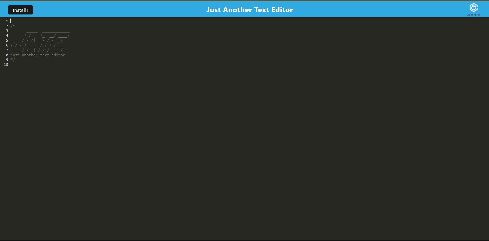

# J.A.T.E. (Just Another Text Editor) 🚀

J. A. T. E. is a cutting-edge text editor designed for developers. 
It's equipped with features like JavaScript syntax highlighting and persistent storage, 
ensuring you never lose your work. Made with love, J.A.T.E promises an enhanced coding experience for all its users.



## Table of Contents 📚

- [Features](#features-)
- [Installation](#installation-)
- [Usage](#usage-🖋)
- [Contribution](#contribution-)
- [License](#license-)

## Features 🌟

- **Syntax Highlighting**: Leveraging the power of CodeMirror, J.A.T.E provides beautiful syntax highlighting for JavaScript.
- **Persistent Storage**: Never lose your work! With IndexedDB integration, your notes and code are always saved.
- **PWA Support**: Install J.A.T.E. on your device and use it offline.

## Installation 🛠

1. Clone the repository:

    ```
    git clone https://github.com/didierthomasm/J.A.D.E..git
    ```

2. Navigate to the project directory:

    ```
    cd JATE
    ```

3. Install the dependencies:

    ```
    npm install
    ```

## Usage 🖋

Open `index.html` in your favorite browser and start coding!

## Contribution 🤝

Want to contribute? We welcome all contributions. Fork the repository, make your changes and submit a pull request.

## License ⚖️

MIT

---

Created with ❤️ by [Didier](https://yourportfolio.com)
